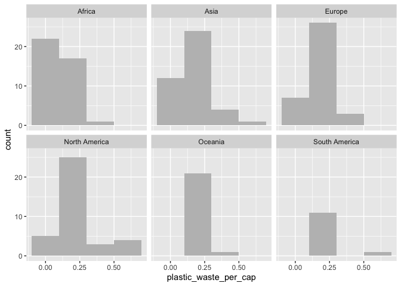

Lab 02 - Plastic waste
================
Marguerite Blais
16 septembre 2025

## Chargement des packages et des données

``` r
library(tidyverse) 
```

``` r
plastic_waste <- read_csv("data/plastic-waste.csv")
```

Commençons par filtrer les données pour retirer le point représenté par
Trinité et Tobago (TTO) qui est un outlier.

``` r
plastic_waste <- plastic_waste %>%
  filter(plastic_waste_per_cap < 3.5)
```

## Exercices

### Exercise 1

``` r
 ggplot(plastic_waste, aes(x = plastic_waste_per_cap)) +
    geom_histogram(binwidth = 0.2, fill = "grey") +
    facet_wrap(~ continent)
```

<!-- -->

En Afrique, la majorité des pays produit une faible quantité de déchets
plastiques par habitant. De plus, la distribution chute rapidement, ce
qui laisse penser que peu de pays ont des niveaux plus élevés. Pour ce
qui est de l’Asie, sa distribution ressemble à celle de l’Afrique,
seulement avec des quantités de déchets un peu plus élevées. Les
distribution de l’Europe et de l’Amérique du Nord sont plus étendues, ce
qui indique des niveaux plus variés entre les pays. En Océanie, les
données sont plutôt concentrées dans la tranche inférieure, ce qui
suggère une faible production de déchets plastiques par habitant.
Finalement, pour l’Afrique, il est possible de voir une séparation nette
entre deux groupes, mais leur niveau de production de déchets reste tout
de même relativement faible.

### Exercise 2

``` r
# insert code here
```

Réponse à la question…

### Exercise 3

Boxplot:

``` r
# insert code here
```

Violin plot:

``` r
# insert code here
```

Réponse à la question…

### Exercise 4

``` r
# insert code here
```

Réponse à la question…

### Exercise 5

``` r
# insert code here
```

``` r
# insert code here
```

Réponse à la question…

## Conclusion

Recréez la visualisation:

``` r
# insert code here
```
