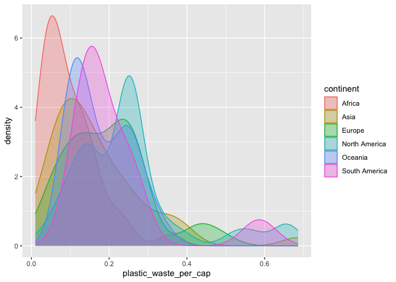
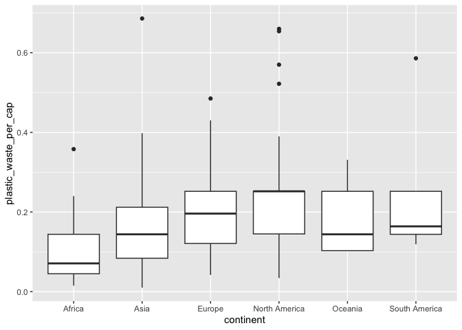
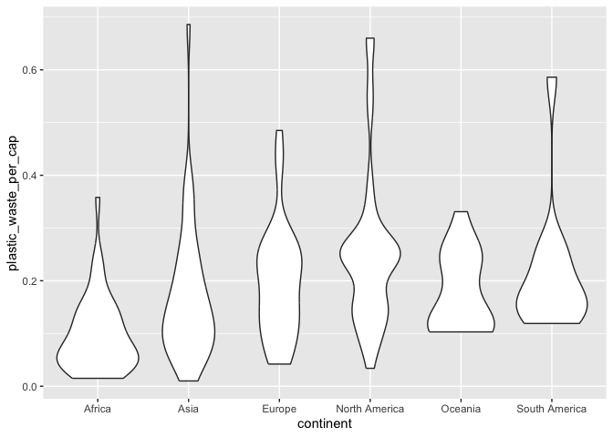

Lab 02 - Plastic waste
================
Marguerite Blais
16 septembre 2025

## Chargement des packages et des données

``` r
library(tidyverse) 
```

``` r
plastic_waste <- read_csv("data/plastic-waste.csv")
```

Commençons par filtrer les données pour retirer le point représenté par
Trinité et Tobago (TTO) qui est un outlier.

``` r
plastic_waste <- plastic_waste %>%
  filter(plastic_waste_per_cap < 3.5)
```

## Exercices

### Exercise 1

``` r
 ggplot(plastic_waste, aes(x = plastic_waste_per_cap)) +
    geom_histogram(binwidth = 0.2, fill = "grey") +
    facet_wrap(~ continent)
```

<!-- -->

En Afrique, la majorité des pays produit une faible quantité de déchets
plastiques par habitant. De plus, la distribution chute rapidement, ce
qui laisse penser que peu de pays ont des niveaux plus élevés. Pour ce
qui est de l’Asie, sa distribution ressemble à celle de l’Afrique,
seulement avec des quantités de déchets un peu plus élevées. Les
distribution de l’Europe et de l’Amérique du Nord sont plus étendues, ce
qui indique des niveaux plus variés entre les pays. En Océanie, les
données sont plutôt concentrées dans la tranche inférieure, ce qui
suggère une faible production de déchets plastiques par habitant.
Finalement, pour l’Amérique du Sud, il est possible de voir une
séparation nette entre deux groupes, mais leur niveau de production de
déchets reste tout de même relativement faible.

### Exercise 2

``` r
ggplot(plastic_waste, aes(x = plastic_waste_per_cap)) +
     geom_density()
```

<!-- -->

``` r
ggplot(plastic_waste, aes(x = plastic_waste_per_cap, color = continent)) +
    geom_density()
```

<!-- -->

``` r
ggplot(plastic_waste, aes(x = plastic_waste_per_cap, fill = continent, color = continent)) +
  geom_density()
```

<!-- -->

``` r
ggplot(plastic_waste, aes(x = plastic_waste_per_cap, fill = continent, color = continent)) +
   geom_density(alpha = 0.3)
```

<!-- -->

Le réglage de la couleur et le réglage de la transparence ne se trouvent
pas au même endroit, car le réglage de la couleur (color et fill) est
lié aux données, et donc, au mapping, alors que le réglage de la
transparence (alpha) est lié à une valeur fixe, donc au setting.

### Exercise 3

Boxplot:

``` r
ggplot(plastic_waste, aes(x = continent, y = plastic_waste_per_cap)) +
         geom_boxplot()
```

<!-- -->

Violin plot:

``` r
ggplot(plastic_waste, aes(x = continent, y = plastic_waste_per_cap)) + geom_violin()
```

<!-- -->

Les violin plots combinent un boxplot avec une courbe de densité, ce qui
permet de visualiser la forme exacte des données, et donc, leur
répartition (ex: les zones de faibles ou de fortes concentrations).

### Exercise 4

``` r
ggplot(data = plastic_waste, aes(x = plastic_waste_per_cap, y = mismanaged_plastic_waste_per_cap, color = continent)) + geom_point()
```

<!-- -->

À partir du graphe de dispersion, il est possible de remarquer une
relation linéaire, et donc, d’affirmer que plus un habitant produit de
déchets, plus ceux-ci sont mal gérés. De plus, en se fiant à la couleur
des points, on remarque que l’Amérique du Nord et l’Europe sont les
continents qui produisent le plus de déchets, mais aussi ceux qui les
gèrent le mieux. De l’autre côté, l’Afrique et l’Océanie produit moins
de déchets, mais ceux-ci sont moins bien gérés.

### Exercise 5

``` r
# insert code here
```

``` r
# insert code here
```

Réponse à la question…

## Conclusion

Recréez la visualisation:

``` r
# insert code here
```
